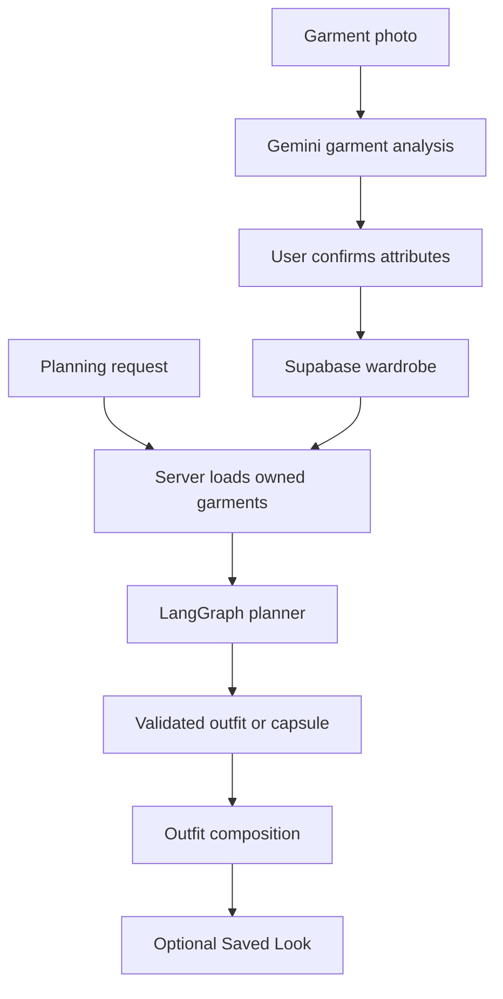
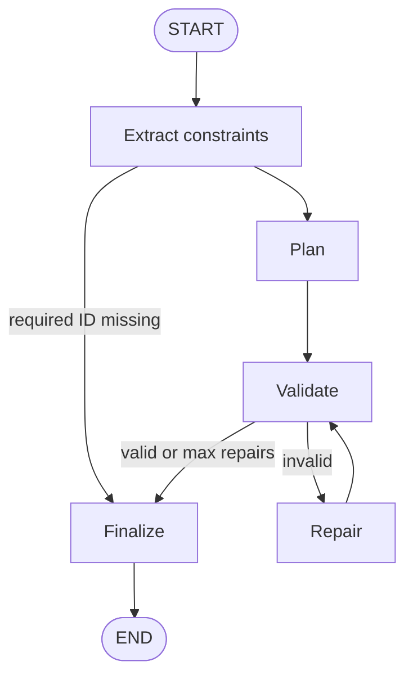
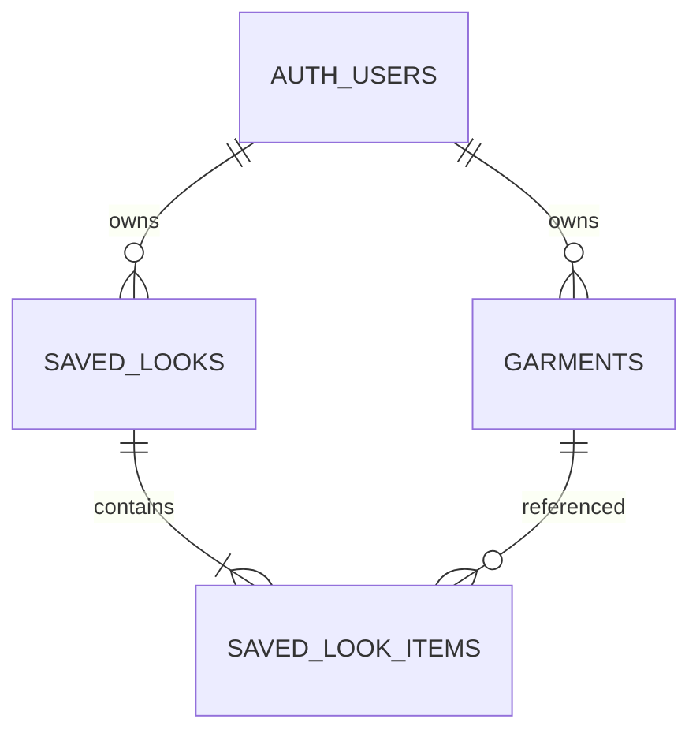

# REWEAR

**Your closet has more outfits than you think.**

[Live Demo](https://rewear-ai-q3yy.vercel.app)

REWEAR is a multimodal wardrobe planning agent. It turns garment photographs into a structured digital wardrobe, then plans outfits and capsules using only pieces the user actually owns.

Rather than returning a model response as-is, REWEAR extracts constraints, proposes a candidate plan, checks that plan with a deterministic TypeScript validator, and repairs invalid candidates inside a bounded LangGraph loop before anything is shown.

## Table of Contents

- [Why REWEAR](#why-rewear)
- [What It Does](#what-it-does)
- [How It Works](#how-it-works)
- [Architecture](#architecture)
- [Planning Agent](#planning-agent)
- [Validation & Repair](#validation--repair)
- [Tech Stack](#tech-stack)
- [Project Structure](#project-structure)
- [API](#api)
- [Data Model](#data-model)
- [Security](#security)
- [Evaluation](#evaluation)
- [Running Locally](#running-locally)
- [Deployment](#deployment)
- [Environment Variables](#environment-variables)
- [Testing](#testing)
- [Design Decisions](#design-decisions)
- [Design Philosophy](#design-philosophy)
- [Future Extensions](#future-extensions)

## Why REWEAR

Most people already own enough clothes. The hard part is seeing combinations across the closet for a given day, trip, or constraint.

Typical AI styling products can recommend garments that are not in the user’s wardrobe. REWEAR treats the closet as a constrained source of truth: every look must resolve to authenticated garment IDs.

That makes the problem an engineering one, not just a prompting one:

- multimodal garment understanding
- structured wardrobe records
- natural-language constraint extraction
- grounded combination planning
- deterministic validation
- bounded repair
- private persistence

## What It Does

**Multimodal garment intake.** A user uploads a JPG, PNG, or WEBP (max 10 MB). The backend sends the image to Gemini and parses a structured garment profile (category, color, material, silhouette, formality, season) through Zod.

**Private digital wardrobe.** Confirmed pieces are stored in Supabase Postgres. Photographs live in a private `wardrobe-images` bucket and are shown with short-lived signed URLs.

**Natural-language planning.** On Plan Looks, requests such as “Give me 3 smart casual work outfits.” or “Build a 6-piece weekend capsule.” go to the planning agent. Optional structured fields include outfit count, max pieces, required or excluded garment IDs, occasions, climate, and formality.

**Deterministic validation and repair.** Candidate plans are checked against the user’s wardrobe and hard constraints. Invalid plans can be repaired at most twice, then either returned or refused.

**Outfit composition.** Looks are assembled in the browser from the user’s own photographs, mapped into roles (upper, lower, dress, outer, footwear, accessory). No image-generation model is called.

**Saved Looks.** An individual outfit can be persisted as an ordered set of owned garment IDs. Saving the same combination again is idempotent.

<!-- Add landing screenshot here -->
<!-- Add wardrobe screenshot here -->
<!-- Add Plan Looks screenshot here -->
<!-- Add Saved Looks screenshot here -->

## How It Works



A photograph becomes a structured row the planner can cite by ID. A later request never sees a raw closet dump from the client: Express reloads the authenticated wardrobe, runs the graph, and the UI layers the selected images. Saving a look stores those IDs, not a free-text fashion description.

## Architecture

```mermaid
flowchart TD
  next[Next.js client] -->|auth and wardrobe CRUD| supabase[Supabase Auth Postgres Storage]
  next -->|Bearer token| api[Express API]
  api -->|verify token and RLS reads| supabase
  api -->|analyze image| gemini[Gemini]
  api --> graph[LangGraph]
  graph -->|extract plan repair| gemini
  graph --> validator[Deterministic validator]
```

The frontend owns the editorial UI and writes garments through the user’s Supabase session. Express owns the AI surface: garment analysis, planning, and saved-look mutations. Identity is the access token. Gemini never talks to the database. The validator never calls Gemini.

On Vercel, Next.js and Express ship as one project. The browser calls same-origin `/api/*` rather than a separate backend host.

**Frontend routes:** `/`, `/auth/sign-in`, `/auth/sign-up`, `/wardrobe`, `/wardrobe/new`, `/plan`, `/looks`, `/looks/[id]`.

**Backend mounts:** `GET /health`, `/api/garments`, `/api/plans`, `/api/looks`.

## Planning Agent

The compiled graph is `START → extract → plan → validate ⇄ repair → finalize → END`.



`MAX_REPAIR_ATTEMPTS` is **2**. If a required garment ID in the request is not in the wardrobe, extract short-circuits and the run is unsatisfied without calling the planner.

**LLM responsibilities**

- Read the natural-language request
- Produce structured constraints
- Propose capsule IDs and outfits
- Revise a candidate given validator violation codes

**Deterministic responsibilities**

- Merge extracted constraints with explicit request fields
- Keep only wardrobe-known required and excluded IDs
- Accept or reject the candidate
- Decide whether another repair is allowed
- Return a plan only when validation passes

Fashion taste is not scored. The graph either returns a grounded plan or a controlled refusal.

## Validation & Repair

`validatePlan()` in `backend/src/planning/validator.ts` is the production checker. Evaluation uses the same function.

| Code | What it prevents |
| --- | --- |
| `UNKNOWN_GARMENT` | IDs that are not in the supplied wardrobe |
| `EXCLUDED_GARMENT_USED` | A garment the user asked to leave out |
| `REQUIRED_GARMENT_MISSING` | A required garment never appearing in the plan |
| `CAPSULE_LIMIT_EXCEEDED` | More unique pieces than `maxPieces` |
| `OUTFIT_COUNT_MISMATCH` | The wrong number of outfits |
| `EMPTY_OUTFIT` | An outfit with no garments |
| `DUPLICATE_GARMENT_IN_OUTFIT` | The same piece twice in one look |
| `DUPLICATE_OUTFIT` | Two looks with the same combination |
| `OUTFIT_OUTSIDE_CAPSULE` | A look using a piece not in the capsule |

Repair receives the previous candidate plus those codes and must try again with the same wardrobe. After two failed repairs, finalize returns no successful plan.

### Grounding example

Wardrobe IDs: `top-01`, `skirt-02`, `jacket-03`.

A candidate cites `top-01` and `jeans-99`.

The validator emits `UNKNOWN_GARMENT`. The repair node is asked to replace the unknown ID using only the three known pieces. A plan that still cites `jeans-99` cannot be returned as success.

## Tech Stack

| Layer | Technology |
| --- | --- |
| Frontend | Next.js 16, React 19, TypeScript, Tailwind CSS 4 |
| Backend | Node.js, Express 5, TypeScript |
| AI | Gemini (`@google/genai`, default model `gemini-3.6-flash`) |
| Agent | LangGraph JS 1.4 |
| Schemas | Zod 4 |
| Validation | Deterministic TypeScript |
| Data | Supabase PostgreSQL |
| Auth | Supabase Auth |
| Storage | Supabase Storage (`wardrobe-images`) |

Transient Gemini `503` / `UNAVAILABLE` responses are retried up to three times on analysis and planning calls.

## Project Structure

```text
rewear-ai/
├── frontend/                 Next.js app
│   └── src/
│       ├── app/              Routes: landing, auth, wardrobe, plan, looks
│       ├── components/       Editorial UI and flow stages
│       └── lib/              Analysis client, planning client, wardrobe, looks
├── backend/
│   ├── src/
│   │   ├── lib/analysis/     Gemini vision + Zod garment schema
│   │   ├── planning/         Graph, validator, repair, wardrobe load
│   │   ├── looks/            Saved Look store and fingerprint
│   │   ├── evaluation/       Synthetic scenarios and metrics
│   │   └── routes/           /api/garments, /api/plans, /api/looks
│   └── supabase/migrations/  Garments, storage, saved looks, RLS
└── package.json              npm workspaces
```

`backend/src/planning/visualize.ts` is a no-op stub so a paid image model cannot be invoked from this path.

## API

| Method | Endpoint | Purpose | Auth |
| --- | --- | --- | --- |
| `GET` | `/health` | Liveness (`{ status: "ok", service: "rewear-api" }`) | None |
| `POST` | `/api/garments/analyze` | Multimodal garment analysis | Bearer |
| `POST` | `/api/plans/generate` | Constraint extract → plan → validate → repair | Bearer |
| `GET` | `/api/looks` | List saved looks | Bearer |
| `POST` | `/api/looks` | Save a look from owned garment IDs | Bearer |
| `GET` | `/api/looks/:id` | Read one look | Bearer |
| `DELETE` | `/api/looks/:id` | Delete one look | Bearer |

Wardrobe rows and image uploads are written by the Next.js client against Supabase, not through a garments CRUD API on Express.

## Data Model



`garments` stores confirmed attributes plus `image_path`. `saved_looks` stores title, occasion, rationale, and a per-user `fingerprint` of `garmentIds.join("|")`. `saved_look_items` keeps ordered foreign keys into `garments`.

Looks reference real IDs so a later view can rebuild composition from current photographs. If a garment is deleted, its look items cascade away; the look row can remain.

## Security

- Supabase Auth on the client; Express verifies `Authorization: Bearer` with `supabase.auth.getUser(token)`
- User id is never taken from the request body
- Planning and saved-look reads/writes use a user-scoped Supabase client so RLS still applies
- `garments`, `saved_looks`, and `saved_look_items` are own-only; look items must belong to a look the user owns and a garment the user owns
- `wardrobe-images` is a private bucket; object keys must start with `auth.uid()`
- The UI loads photographs through signed URLs (one hour)
- `GEMINI_API_KEY` is backend-only
- Uploads are limited to JPEG, PNG, and WEBP; MIME is sniffed from magic bytes; size cap is 10 MB
- Gemini JSON is parsed with Zod; invalid structure is a controlled failure
- Validator enforces wardrobe membership before a plan is returned
- Repair is capped at two attempts
- Request logs shorten user ids and sanitize keys, tokens, and long binary payloads

`SUPABASE_SERVICE_ROLE_KEY` appears in the backend env example. The live request path does not use a service-role client to skip RLS.

## Evaluation

The harness in `backend/src/evaluation/` runs **38** synthetic scenarios across eight categories (basic, capsule, required, exclusion, repetition, occasion, insufficient, edge) and eight fixture wardrobes. It calls the **same** `validatePlan()` and planning graph as production.

| Mode | Command | Gemini | Intent |
| --- | --- | --- | --- |
| Deterministic | `npm run eval` | No | Scripted candidates through the production graph; CI-safe |
| Live | `npm run eval:live` | Yes, text planning only | Real extract → plan → validate → repair |

Live evaluation requires `REWEAR_EVAL_LIVE=1` (set by `eval:live`) and `GEMINI_API_KEY`. The default live sample is **3** scenarios (`--limit N` or `--all`). It does not call image models, garment analysis, or Saved Looks. JSON reports write to `backend/evaluation/results/`, which is gitignored.

Metrics (computed from a run, not hardcoded): first-pass validity, final validity, repair rate, average repair attempts, unknown-garment rate, hard-constraint satisfaction on final-valid plans, violation counts, and PASS/FAIL split for expected-valid vs expected-unsatisfiable.

Expected-unsatisfiable success is a controlled refusal: no successful plan, no hallucinated IDs. Deterministic percentages measure the harness and scripted candidates, not Gemini fashion quality. No live benchmark file is committed; run `npm run eval:live -- --limit 2` locally to measure the agent.

## Running Locally

**Prerequisites:** Node.js 20+ with npm, a Supabase project, and a Gemini API key.

```bash
git clone https://github.com/singh-khushi30/rewear-ai.git
cd rewear-ai
npm install
```

```bash
cp frontend/.env.example frontend/.env.local
cp backend/.env.example backend/.env
```

Fill the names listed below. In the Supabase SQL Editor, apply in order:

1. `backend/supabase/migrations/20260918120000_garments_and_storage.sql`
2. `backend/supabase/migrations/20260924120000_saved_looks.sql`

```bash
npm run dev:backend
npm run dev:frontend
```

| | URL |
| --- | --- |
| Live production app | [https://rewear-ai-q3yy.vercel.app](https://rewear-ai-q3yy.vercel.app) |
| Local frontend | [http://localhost:3000](http://localhost:3000) |
| Local backend | [http://localhost:4000](http://localhost:4000) |

## Deployment

Production is a **single Vercel project**: [https://rewear-ai-q3yy.vercel.app](https://rewear-ai-q3yy.vercel.app).

- Next.js serves the application
- The existing Express API is exposed from the same deployment under `/api/*`
- Production browser requests use same-origin `/api` (no separate API origin)

## Environment Variables

Names only. Copy from the example files; do not commit filled `.env` files.

**Frontend** (`frontend/.env.example`)

- `NEXT_PUBLIC_API_URL`
- `NEXT_PUBLIC_SUPABASE_URL`
- `NEXT_PUBLIC_SUPABASE_ANON_KEY`

**Backend** (`backend/.env.example`)

- `PORT`
- `FRONTEND_ORIGIN`
- `SUPABASE_URL`
- `SUPABASE_ANON_KEY`
- `SUPABASE_SERVICE_ROLE_KEY`
- `GEMINI_API_KEY`
- `GEMINI_MODEL`

Live evaluation also reads `REWEAR_EVAL_LIVE`. It is not an application runtime variable.

## Testing

```bash
npm run lint
npm run typecheck
npm test -w frontend
npm run build -w frontend

npm test -w backend
npm run typecheck -w backend
npm run build -w backend

npm run eval
npm run eval:live -- --limit 2
```

The current suites are **27** frontend tests and **62** backend tests, including validator, graph, looks, analysis retry, and evaluator metrics.

## Design Decisions

**Validate after the LLM.** Structured decoding does not prove a candidate stays inside the wardrobe or respects hard limits. A separate TypeScript pass is the source of truth for what the user may see.

**No vector database.** The wardrobe is a small structured table. Planning needs exact IDs and attributes, not nearest-neighbor retrieval.

**Composition instead of generated previews.** `OutfitComposition` layers the user’s photographs by garment role. That keeps the preview free and keeps the real garment as the visual source. Paid image generation is not part of the active product path.

**Relational Saved Looks.** A look is an ordered list of owned garment IDs plus a fingerprint. Re-saving the same set returns the existing row.

**User-scoped Supabase on the server.** Planning loads garments with the caller’s token so RLS, not a privileged bypass, defines the closet.

## Design Philosophy

The UI is an editorial stylist workspace: ivory (`#F4F0E8`), olive (`#252D1E`), Cormorant Garamond, and Outfit. Real wardrobe photographs stay in the foreground. Hidden model reasoning is not shown. Errors are short and user-safe.

## Future Extensions

These are not implemented:

- Optional generated outfit visualization or virtual try-on
- Live weather APIs beyond the optional `climate` field on a planning request
- Longer-term wardrobe insights across many planning sessions
